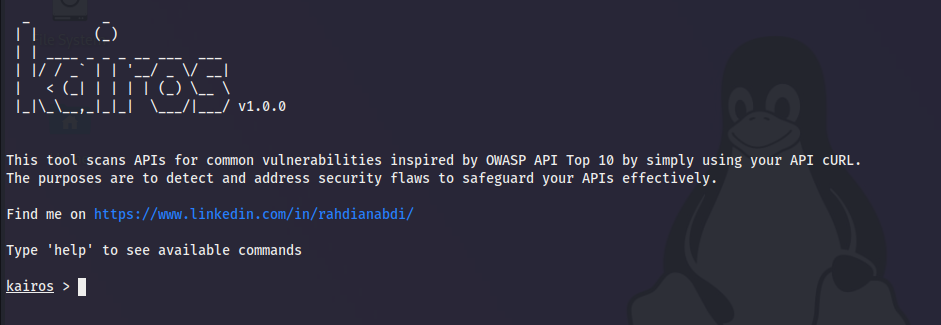

<div align="center">
  <a href="">
    
  </a>

  <p align="center">
    Kairos v1.0.0
  </p>
</div>

# Kairos API Vulnerability Scanner

Kairos is an open-source API vulnerability scanner designed to detect and address security flaws in your APIs. Inspired by the OWASP API Top 10, Kairos helps safeguard your APIs effectively by scanning for common vulnerabilities using API cURL commands.

## Log Update
- Version 1.0.0 (8/6/2024) Adding fuzzer feature.
- Version 1.0.0 (7/15/2024) User can set-up all the payload and review it with new command.
- Version 1.0.0 (7/14/2024) Refactor and can add cURL list file for multiple scan. Must be separated by line with every API in one-line format

## Features

- Scans for vulnerabilities such as:
  - Broken Object Level Authorization (BOLA)
  - Broken User Authentication (BUA)
  - Broken Object Property Level Authorization (BOPLA)
  - Unrestricted Resource Consumption (URC)
  - Broken Function Level Authorization (BFLA)
  - Server Side Request Forgery (SSRF)
  - Security Misconfiguration
  - Improper Asset Management
  - Excessive Data Exposure
  - Injection Attacks
  - Remote Code Execution (RCE)
- Customizable parameters for targeted scanning
- User-friendly command-line interface (CLI)

## Installation

1. Clone the repository:
    ```bash
    git clone https://github.com/rahdian-abdi/kairos.git
    cd kairos
    ```

2. Install the required dependencies:
    ```bash
    pip install -r requirements.txt
    ```

## Usage

### Running Kairos

To start the Kairos CLI, run:
```bash
python kairos.py
```

### Commands

- **help**: Display available commands.
- **input**: Collect custom input for various scans.
- **payload**: Show the current user inputs.
- **scan**: Start scanning the provided APIs.
- **exit**: Exit the tool.

### Custom Inputs

Use the `input` command to set custom inputs for your scans. Available options include:

- `set curlList <file>`: Specify the file containing the list of cURL commands or just put single curl with the same command
- `set bolaFile <file>`: Specify the custom file for Broken Object Level Authorization.
- `set buaFile <file>`: Specify the fuzzing file for Broken User Authentication.
- `set buaParameter <parameter>`: Specify the parameter to fuzz for Broken User Authentication.
- `set boplaMethod <method>`: Specify the HTTP method for Broken Object Property Level Authorization.
- `set boplaPayload`: Specify the payload for Broken Object Property Level Authorization. Enter 'done' when finished.
- `set urcFile <file>`: Specify the fuzzing file for Unrestricted Resource Consumption.
- `set urcParameter <parameter>`: Specify the parameter to fuzz for Unrestricted Resource Consumption.
- `set ssrfParameter <parameter>`: Specify the parameter to fuzz for Server Side Request Forgery.

### Example Usage

1. Set custom inputs:
    ```bash
    set curlList my_curl_list.txt
    set bolaFile bola_uuids.txt
    set buaFile bua_fuzz.txt
    set buaParameter username
    set boplaMethod POST
    set boplaPayload
    > Enter the field you want to change or add: role
    > Enter the value for role: admin
    > Enter the field you want to change or add: done
    set urcFile urc_fuzz.txt
    set urcParameter token
    set ssrfParameter url
    ```

2. Show the current user inputs:
    ```bash
    payload
    ```

3. Start the scan:
    ```bash
    scan
    ```

## Contributing

Contributions are welcome! Please open an issue or submit a pull request on GitHub.

## License

This project is licensed under the MIT License.

## Contact

Find me on [LinkedIn](https://www.linkedin.com/in/rahdianabdi/)
